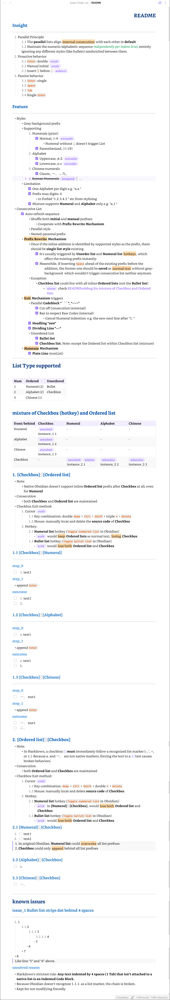

## Preview

### Insight 
---
1. Parallel Principle 
	1.1 The **parallel** lists align ==internal consecution== with each other in **default** 
	1.2 Maintain the numeric/alphabetic sequence *independently per indent level*, entirely ignoring any different styles (like bullets) sandwiched between them.
2. Proactive behavior 
	2.1 `Enter`: double #style 
	2.2 Manual initial #style 
	2.3 Insert `\` before `.` #silence 
3. Passive behavior 
	3.1 `Enter`: single 
	3.2 `Space` 
	3.3 `Tab` 
	3.4 Single `Enter` 

### Feature 
---
- Styles 
	- Grey-background prefix 
	- Supporting
		1. Numerals (prior)
			- [-] Normal, 0-9 #mixable 
				- Numeral without `.` doesn't trigger List  
			- [-] Parenthesized, (0)-(9)
		2. Alphabet 
			- [-] Uppercase, A-Z #mixable 
			- [-] Lowercase, a-z #mixable 
		3. Chinese numerals 
			- [-] Classic, 一、... 九、
		4. ~~Roman Numerals~~ #suspend 
			- note: treat as normal texts 
			- Suspend: The complex interaction of triggering Roman numerals via specific `Space + Enter` sequences is extremely difficult to reliably capture within CodeMirror's transaction-based state engine, as the auto-formatting engine and keystroke events constantly fight each other. Taking your advice, **we will suspend the complex Roman toggle mechanics** for now to ensure the core features remain rock-solid. Basic Roman consecutive counting will still work if typed out (e.g., `III.`), but the auto-magic toggle is removed.
			- [ ] Classic, I-II...
				- Initial "I."  unrelates consecutive "H. ", inline: 
					- [-] `Space` > **Alphabet** (shuffle to "A/a")
					- [ ] `Space` + `Enter` > **Roman** 
						- Only if `Enter` right behind `Space`, even if inline content exists. Otherwise, `Enter` trigger Alphabet consecution e.g. `Enter` behind inline content. 
						- #issue `Enter` turned Alphabet ("A") to Roman, but suddenly auto-back to Alphabet ("A") 
					- [ ] `Space` + double `Enter` > step forward  (upgrade inline list level) 
				- Initial "I." beneath consecutive "H. ", next-line: 
					- Single `Enter` > **Alphabet** 
					- Double `Enter` > **Roman**
					- Triple `Enter` > step forward  (upgrade list level) 
				- Conclusion
					- [ ] Alphabet first, Roman second activated only by `Enter` right behind prefix's `Space` 
	- Limitation 
		- [-] One Alphabet per digit e.g. "a.a "
		- [-] Prefix max digits: 4
			- to Forbid "1.2.3.4.5 " etc from stylizing 
		- [-] Mixture supports **Numeral** and **Alphabet** only e.g. "a.1 "
- Consecutive List 
	- [-] Auto refresh sequence
		- Shuffle both **initial** and **manual** prefixes 
			- Cooperate with **Prefix Rewrite Mechanism** 
		- Parallel style 
		- Nested-parental prefix 
	- **==Prefix Rewrite== Mechanism** 
		- Once if the inline addition is identified by supported styles as the prefix, there should be **single list style** existing 
			- [-] It's usually triggered by **Unorder list** and **Numeral list** ==hotkeys==, which effect the existing prefix instantly.
			- [-] Meanwhile, if inserting `Space` ahead of the existing prefix before the addition, the former one should be **saved** as ==normal text== without grey-background  which wouldn't trigger consecutive list neither anymore. 
		- Exception 
			- **Checkbox list** could live with all inline **Ordered lists** (not the **Bullet list**) 
				- #issue check [[README#debug for mixture of Checkbox and Ordered lists]]
	- **==Exit== Mechanism** triggers 
		- Parallel **Codeblock "\`\`\`", "\~\~\~"**
			- [-] Cut off Consecution (external) 
			- [-] Ban to respect Raw Codes (internal) 
				- Cancel Numeral indention  e.g. the new next line after "1. "
		- [-] **Headling "###"** 
		- [-] **Dividing Line "---"** 
		- Unordered List 
			- [-] **Bullet list**
			- [-] **Checkbox list**, Note: except the Ordered list within Checkbox list (mixture) 
	- **==Maintain== Mechanism** 
		- [-] **Plain Line** (nonList)
---
# List Type supported 

| Num | Ordered      | Unordered |
| --- | ------------ | --------- |
| 1   | Numeral (2)  | Bullet    |
| 2   | Alphabet (2) | Checkbox  |
| 3   | Chinese (1)  |           |

## mixture of Checkbox (hotkey) and Ordered list 
| front/behind | Checkbox               | Numeral                         | Alphabet              | Chinese                |
| ------------ | ---------------------- | ------------------------------- | --------------------- | ---------------------- |
| Numeral      | #resolved instance_1.1 | -                               | -                     | -                      |
| Alphabet     | #resolved instance_1.2 | -                               | -                     | -                      |
| Chinese      | #resolved instance_1.3 | -                               | -                     | -                      |
| Checkbox     | -                      | #resolved #native  instance_2.1 | #abandon instance_2.2 | #abandon  instance_2.3 |
### 1. {Checkbox}` `{Ordered list}
- Note:
	- Native Obsidian doesn't support inline **Ordered list** prefix after **Checkbox** at all, even for **Numeral** 
- Consecution
	- both **Checkbox** and **Ordered list** are maintained 
- Checkbox Exit method: 
	1. Cursor #safe
		1.1 Key combination: double `Home` > `Ctrl` + `Shift` + triple `→` > `Delete` 
		1.2 Mouse: manually locat and delete the **source code** of **Checkbox** 
	2. Hotkey: 
		2.1 **Numeral list** hotkey (`Toggle numbered list` in Obsidian)
			- #safe would ==keep== **Ordered lists** as normal text, ==losing== **Checkbox**  
		1.1 **Bullet list** hotkey (`Toggle bullet list` in Obsidian)
			- #risk would ==lose both== **Ordered list** and **Checkbox** 
#### 1.1 {Checkbox}` `{Numeral}
---
##### step_0
- [ ] 1. test1
##### step_1
- append `Enter`
##### outcome 
- [ ] 1. test1
- [ ] 2. 

#### 1.2 {Checkbox}` `{Alphabet}
---
##### step_0
- [ ] a. test1
##### step_1
- append `Enter`
##### outcome
- [ ] a. test1
- [ ] b. 

#### 1.3 {Checkbox}` `{Chinese}
---
##### step_0
- [ ] 一、 test1
##### step_1
- append `Enter` 
##### outcome
- [ ] 一、 test1
- [ ] 二、 

### 2. {Ordered list}` `{Checkbox}
- Note: 
	- In Markdown, a checkbox [ ] **must** immediately follow a recognized list marker (-, \*, +, or 1.). Because a. and 一、 are not native markers, forcing the text to a. [ ] test causes broken behaviors. 
- Consecution 
	- both **Ordered list** and **Checkbox** are maintained 
- Checkbox Exit method: 
	1. Cursor #safe 
		1.1 Key combination: `Home` > `Ctrl` + `Shift` + double `←` > `Delete` 
		1.2 Mouse: manually locat and delete **source code** of **Checkbox** 
	2. Hotkey: 
		2.1 **Numeral list** hotkey (`Toggle numbered list` in Obsidian)
			- #risk in **{Numeral}` `{Checkbox}**, would ==lose both== **Ordered list** and **Checkbox** 
		1.1 **Bullet list** hotkey (`Toggle bullet list` in Obsidian)
			- #risk would ==lose both== **Ordered list** and **Checkbox** 
#### 2.1 {Numeral}` `{Checkbox}
1. [ ] test1
2. [ ] test2
> 1. In original Obsidian, **Numeral list** could ==overwrite== all list prefixes  
> 2. **Checkbox** could only ==append== behind all list prefixes  

#### 2.2 {Alphabet}` `{Checkbox}
- [ ] a. 

#### 2.3 {Chinese}` `{Checkbox}
- [ ] 一、 

---
# known issues 
#### issue_1 Bullet list strips dot behind 4 spaces 
---
1. 1
	1.1 2
		1.1.1 3
			1.1.1.1 4
			- 5
		- 6
	- 7
- 8
> Like line "5" and "6" above.
##### unsolved reason 
- Markdown's strictest rule: **Any text indented by 4 spaces (1 Tab) that isn't attached to a native list is an Indented Code Block.**
- Because Obsidian doesn't recognize 1.1.1. as a list marker, the chain is broken. 
- Kept for not modifying forcedly 